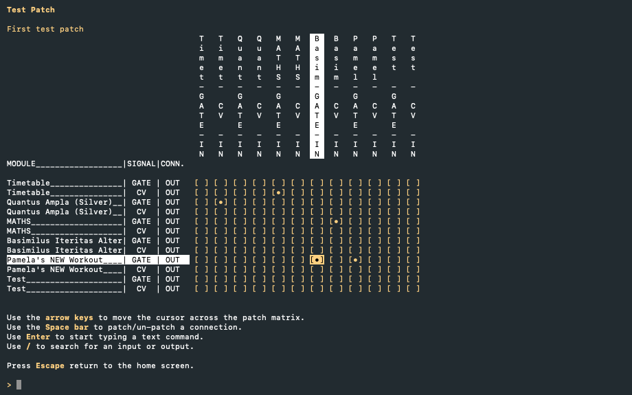

# Patches

[](https://github.com/phonofidelic/Patches/actions/workflows/pr-tests.yml)

A .NET 10 terminal UI application for managing Eurorack modular synthesizer patch connections. Built with [Spectre.Console](https://spectreconsole.net/) for the interactive console UI and SQLite (via EF Core) for local state persistence.



## Architecture

The solution follows Clean Architecture across these projects:

| Project | Role |
|---|---|
| `Patches.Domain` | Entities: `Module`, `Patch`, `PatchMatrix`, `Connection`, `ConnectionPoint`, `Vendor` |
| `Patches.Application` | Handler contracts and use-case handlers (CQRS style) |
| `Patches.Infrastructure` | EF Core SQLite repositories, `ModulargridApiClient` (JSON import) |
| `Patches.Services` | `ConsoleUIService` |
| `Patches.Shared` | Commands, queries, and DTOs shared across layers |
| `Patches.CLI` | Entry point; Spectre.Console screens (`PatchMatrixScreen`, `LoadPatchScreen`, `ModulesList`, etc.) |
| `Patches.Tests` | xUnit test project |

## Features

- **PatchMatrixScreen** — keyboard and text command navigation across the patch matrix
- **`/search` command** — filter modules by name (cancellable), results ordered alphabetically
- **Module import** — import modules from a ModularGrid JSON export
- **Connection tracking** — `IConnectionRepository` with composite-key Connection entity

## Prerequisites

- [.NET 10 SDK](https://dotnet.microsoft.com/download)

## Running the app

```bash
cd Patches.CLI
dotnet run
```
